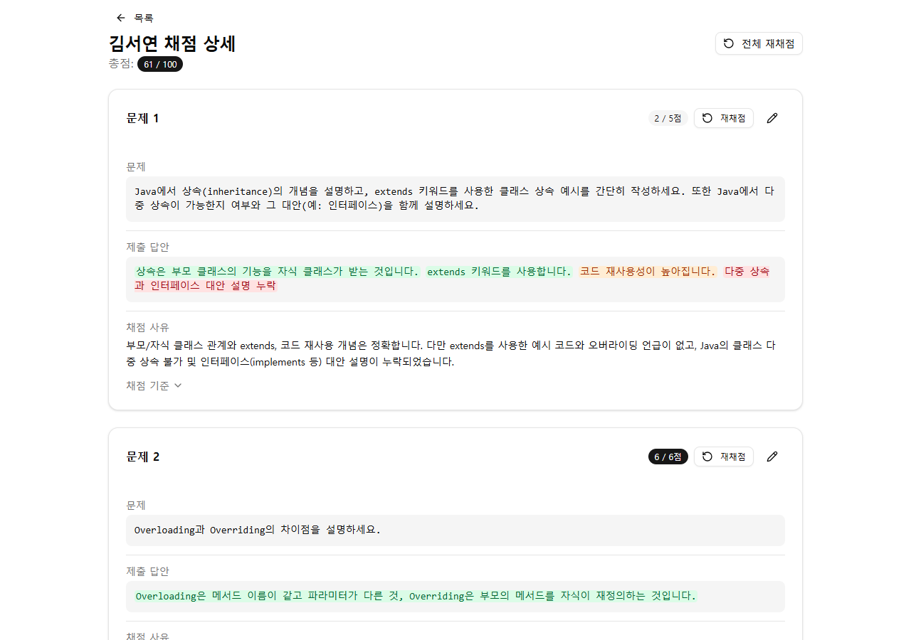
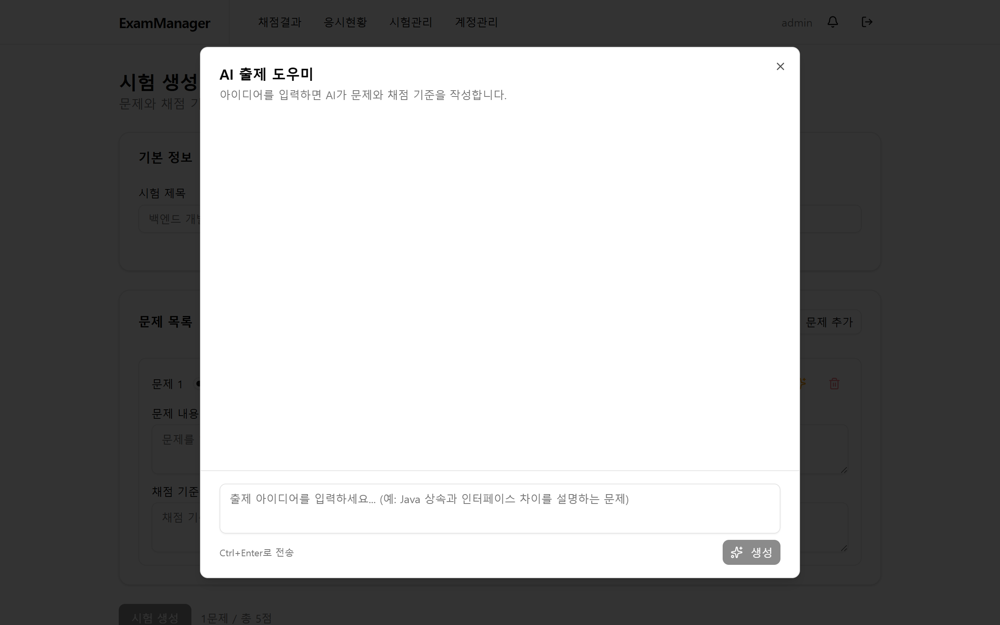
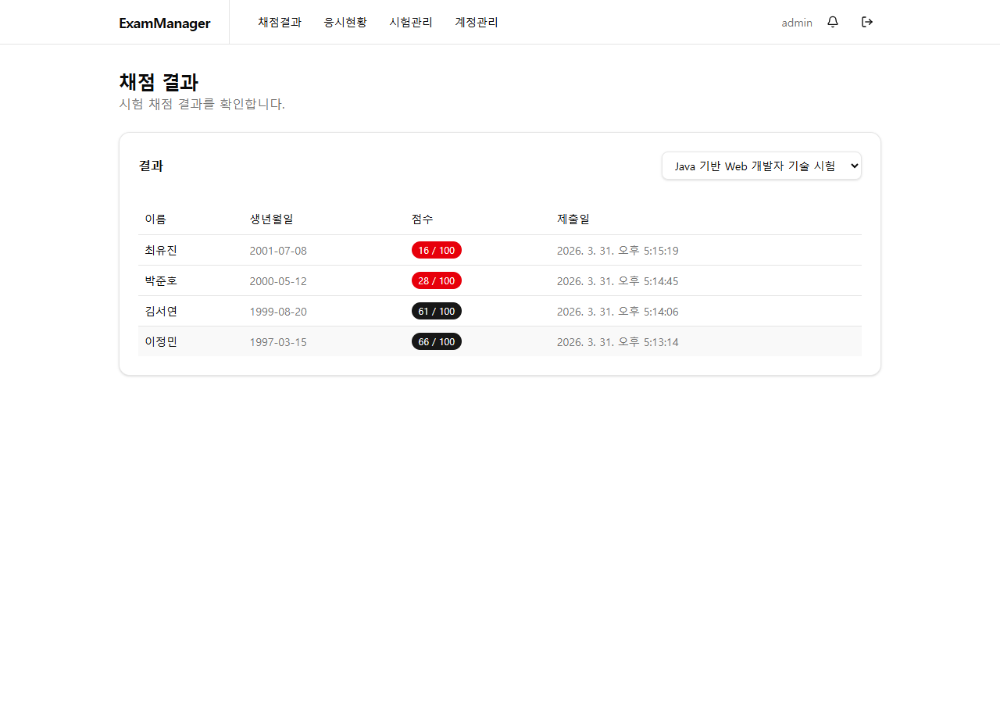
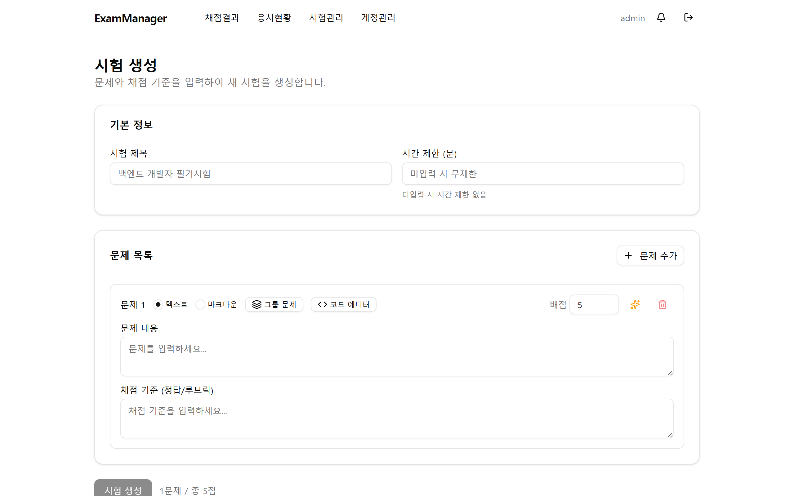
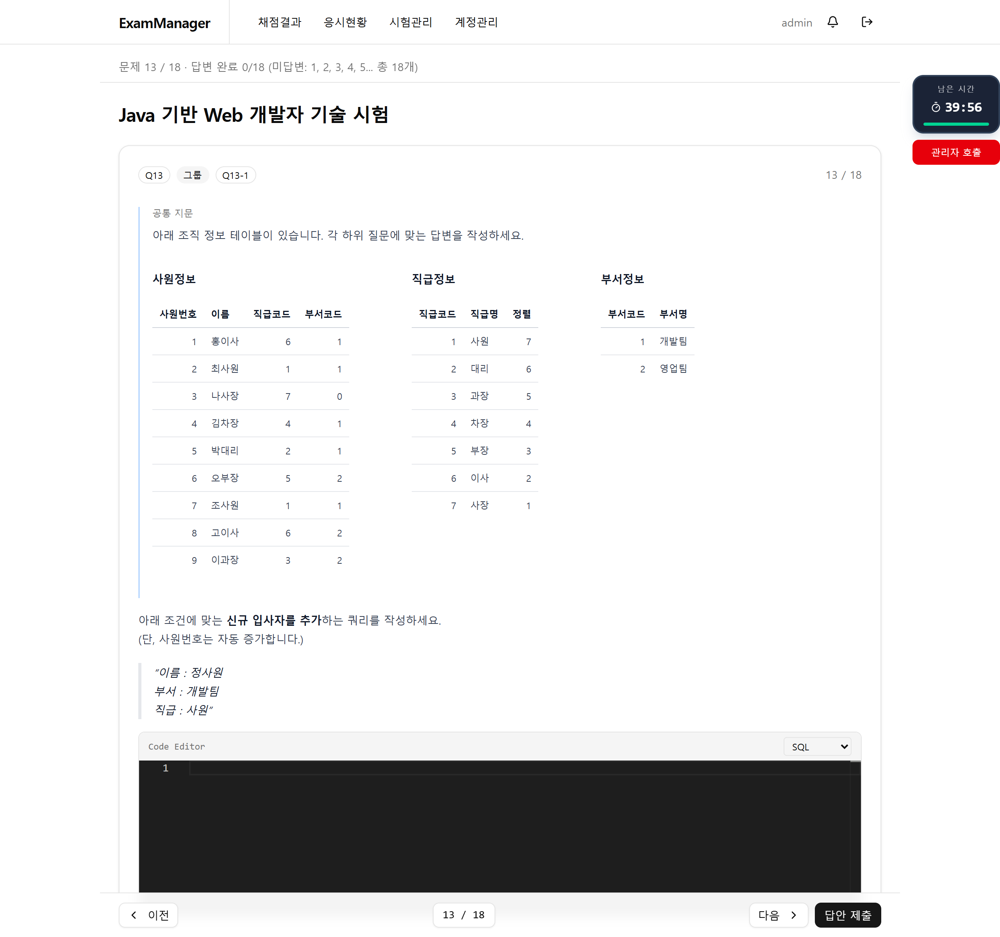
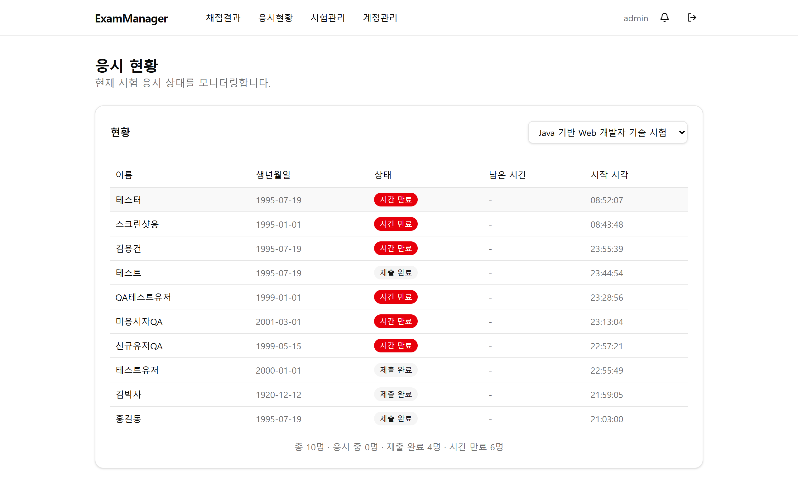

# ExamManager

**사내 기술 면접 필기 시험의 출제부터 응시, 채점까지 전 과정을 관리하는 웹 서비스**

기존 수동 채점 방식을 LLM 기반 자동 채점으로 전환하여, 채점 소요 시간 단축과 평가 일관성 확보를 목표로 개발하였습니다.

---

## 배경

사내 기술 면접 필기 시험은 관리자가 수험자별 답안을 직접 검토하고 점수를 부여하는 방식으로 운영되었습니다. 이 과정에서 다음과 같은 문제가 있었습니다.

| 기존 방식의 한계 | 개선 방향 |
|------------------|-----------|
| 채점자가 답안을 하나하나 읽고 수동으로 점수를 부여 | 답안 제출 즉시 LLM이 비동기로 자동 채점 |
| 채점 기준 해석이 채점자마다 달라 일관성 부족 | 채점 기준(루브릭) 기반의 일관된 의미 평가 |
| 채점 결과에 대한 근거 확인이 어려움 | 문제별 채점 사유와 피드백을 자동 생성 |

이러한 문제를 해결하기 위해, **LLM 기반 의미 채점 시스템**을 도입하여 시험 운영 전 과정을 웹으로 전환하였습니다.

---

## 주요 기능

### AI 자동 채점

답안 제출 시 LLM이 채점 기준과 수험자 답안을 비교하여 자동으로 채점합니다. 모범 답안과 정확히 일치하지 않더라도 핵심 개념이 포함되어 있으면 정답으로 인정합니다.

채점 결과는 관리자가 알아보기 쉽도록 답안의 정오 구간을 색상 마커로 구분하여 채점 근거를 시각화합니다.



- **의미 기반 채점** — 단순 키워드 매칭이 아닌 개념 이해도 평가. 뉘앙스가 유사하면 정답 인정
- **답안 마커** — 답안 내 정답(초록)/오답(빨강)/부분 정답(주황) 구간을 색상으로 자동 태깅하여, 관리자가 채점 근거를 한눈에 파악할 수 있도록 시각화
- **관리자 첨삭** — 자동 채점 결과를 관리자가 검토하고 득점/피드백을 수정하거나, 마커 툴바로 답안의 정오 구간을 직접 지정 가능
- **재채점** — 채점 기준 수정 후 개별 또는 전체 답안을 LLM으로 재채점

### AI 출제 도우미

시험 문제의 추가·변경이 빈번한 운영 환경을 고려하여, 주제와 난이도를 입력하면 LLM이 문제 본문과 채점 기준을 자동으로 생성합니다.

멀티턴 대화를 지원하여 "난이도를 높여달라", "SQL 문제로 변경해달라" 등 이전 맥락을 유지한 반복 수정이 가능합니다.



### 시험 운영

시험 생성부터 응시, 실시간 모니터링까지 전 과정을 웹 UI로 관리합니다.

#### 채점 결과 대시보드

수험자별 총점, 채점 완료 여부를 한눈에 확인합니다. 채점 중인 항목은 자동 폴링으로 실시간 반영됩니다.



#### 시험 생성

문제 본문 + 채점 기준 + 배점을 구성합니다. 마크다운 서식, 그룹 문제(꼬리 문제), 코드 에디터(Monaco)를 지원합니다.



#### 시험 응시

한 페이지에 한 문제씩 표시하여 집중도를 높이고, 코드 문제에는 Monaco 에디터를 제공합니다.

그룹 문제(꼬리 문제)는 공통 지문과 하위 문제를 한 페이지에 함께 표시하여, 지문을 오가지 않고 풀 수 있습니다.

서버 기반 타이머로 남은 시간을 표시하며, 시간 초과 시 자동 제출됩니다.



#### 응시 현황 모니터링

수험자별 상태(응시 중/제출 완료/시간 만료)와 남은 시간을 실시간으로 모니터링합니다.



---

## 기술 스택

| 분류 | 기술 |
|------|------|
| **Frontend** | Vue 3, Vite 7, Pinia, Vue Router, shadcn-vue (Tailwind CSS v4) |
| **Backend** | Spring Boot 3.5 (Java 17, Gradle 8.6) |
| **Database** | MariaDB 10+ |
| **LLM** | Ollama (gemma3) / OpenAI (gpt-5.2) — `llm.provider` 설정으로 전환 |
| **코드 에디터** | Monaco Editor (로컬 번들, CDN 의존성 없음) |
| **마크다운** | markdown-it + highlight.js (github-dark 테마) |
| **알림** | SSE + vue-sonner Toast + Browser Notification API |

---

## 시작하기

### 사전 요구사항

- **Java** 17+
- **Node.js** 18+
- **MariaDB** 10+
- **Ollama** (선택 — LLM 채점/출제 사용 시)

### 데이터베이스 설정

```sql
CREATE DATABASE exam_scorer;
```

초기 시드 데이터가 필요한 경우:

```bash
mysql -u root -p exam_scorer < backend/src/main/resources/data/seed.sql
```

### Backend 실행

```bash
cd backend

# application-local.yml 설정 (DB 자격증명, CORS 등)
# backend/src/main/resources/application-local.yml 파일 생성 필요

./gradlew.bat bootRun    # Windows
./gradlew bootRun        # macOS/Linux
```

기본 관리자 계정: `admin` / `admin123` (최초 로그인 시 비밀번호 변경 필요)

### Frontend 실행

```bash
cd frontend

# .env 파일 설정 (.env.example 참고)
cp .env.example .env

npm install --legacy-peer-deps
npm run dev
```

- Frontend: http://localhost:5173
- Backend API: http://localhost:8080

### LLM 설정 (선택)

```bash
# Ollama 사용 시 (기본값)
ollama run gemma3

# OpenAI 사용 시 — application-local.yml에서 설정
# llm.provider: openai
# openai.api-key: sk-...

# LLM 미가용 시 → 단순 비교 폴백 채점 동작
```

---

## 프로젝트 구조

```
exam-scorer/
├── frontend/                    # Vue 3 SPA
│   └── src/
│       ├── api/                 # Axios API 호출
│       ├── components/          # 커스텀 + shadcn-vue UI 컴포넌트
│       ├── composables/         # Vue 컴포저블 (useNotifications)
│       ├── lib/                 # 유틸리티 (cn 헬퍼, markdown 렌더러)
│       ├── stores/              # Pinia 스토어 (auth, exam)
│       ├── views/
│       │   ├── admin/           # 관리자 페이지
│       │   └── exam/            # 수험자 페이지
│       └── router/              # Vue Router
├── backend/                     # Spring Boot API
│   └── src/main/java/com/exammanager/
│       ├── config/              # Security, CORS, LLM 설정
│       ├── controller/          # REST Controllers
│       ├── service/             # 비즈니스 로직 + LLM 클라이언트
│       ├── repository/          # JPA Repositories
│       ├── entity/              # JPA Entities
│       └── dto/                 # 요청/응답 DTO
└── docs/                        # 문서
```

## 설정 파일

### Backend

```
application.yml          # 운영 기본값 (validate, 환경변수 바인딩)
application-dev.yml      # 개발 오버라이드 (update, show-sql)
application-local.yml    # DB 자격증명, CORS origin (gitignored)
```

### Frontend

```
.env.example             # 환경변수 안내 (git 포함)
.env                     # 실제 값 (gitignored)
```

| 변수 | 설명 | 기본값 |
|------|------|--------|
| `API_TARGET` | 백엔드 API 프록시 대상 | `http://localhost:8080` |
| `ALLOWED_HOSTS` | Vite dev server 허용 호스트 | - |